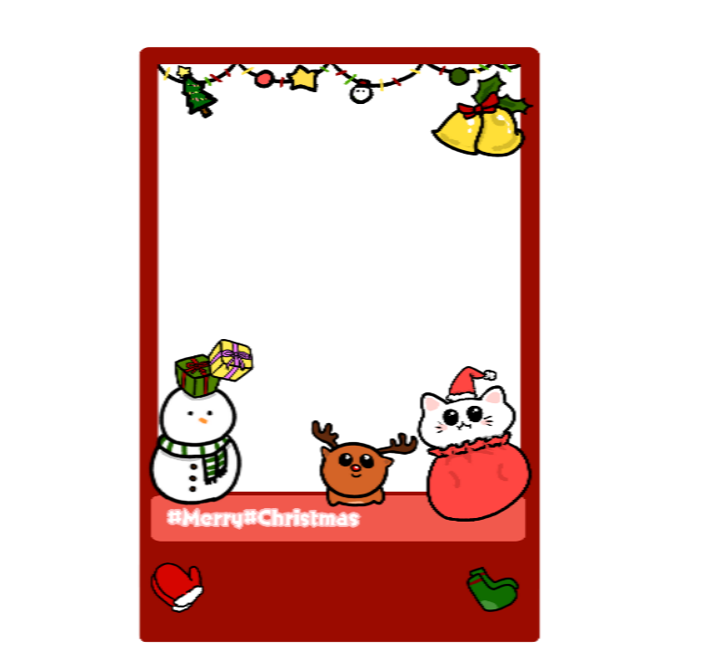
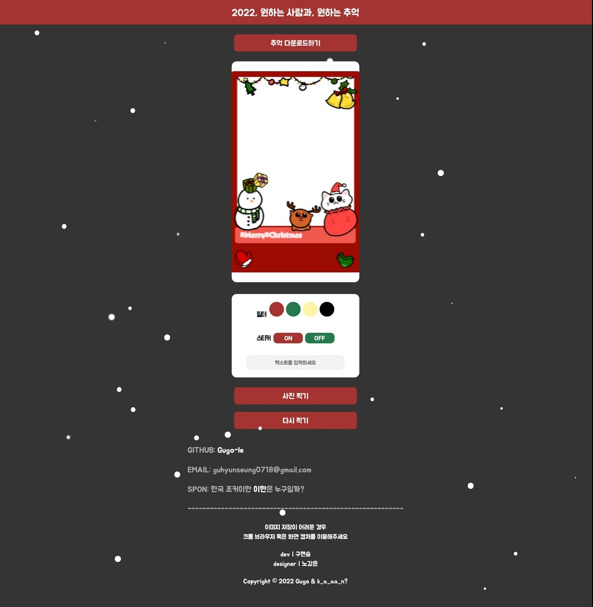
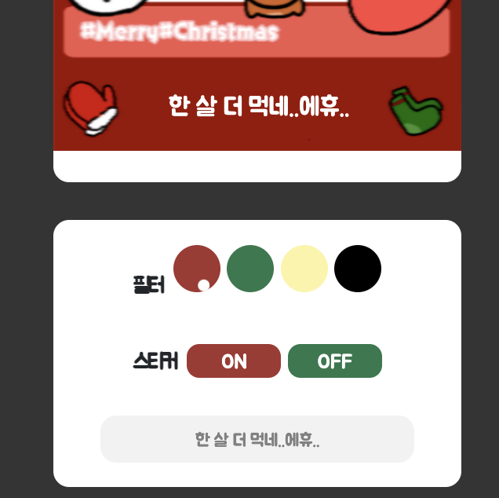

# 2022, 원하는 사람과, 원하는 추억
### 코드네임: '나와 너'
 

안녕하세요! 구현승(Gugo-le)입니다.
이번 프로젝트는 저 혼자가 아닌 한 명의 디자이너와 
프로젝트를 개발하게 되었습니다.

 
dev | <a href="https://github.com/Gugo-le">구현승</a> designer | <a href="https://instagram.com/k_a_aa_n?igshid=MDM4ZDc5MmU=">노강은</a>

## About This
제가 오늘 소개할 프로젝트의 코드네임은 "나와 너"입니다.

2022년의 마지막 달을 장식할, 2022의 '나와 너'를 기억하기 위해서 만든 프로젝트입니다.

이제 저도 고1이 순식간에 지나갔고 이제는 고2, 18살을 바라보는 입장에서 하루 빨리 17살의 추억을 남기고자 하는 마음에 만들어보았습니다.

## 이용 방법

시작하기 버튼을 누르고

사진 찍기 버튼을 누르게 되면 모달창으로 카메라가 띄워지게 되고
찍으면 저 프레임 안으로 사진이 들어가게 됩니다.

그리고 필터 기능이 있어 흑백, 블러, 세피아, 색 반전으로 이루어져 있어 재미있는 연출도 가능하게 끔 제작했습니다. 

사진만 달랑있으면 이상할거 같아 텍스트를 넣을 수 있는 곳도 만들어보았습니다.

그 다음, 위에 추억 다운로드 버튼만 누르면 끝!

## 추후 업데이트

  - [ ] 인공지능 기술을 이용해 스노우 필터 사용하기
  - [ ] 커스텀 필터 기능 만들기
  - [ ] 카드 디자인 추가
  - [ ] 사계절 기능 추가
  - [ ] pc 버전과 모바일 버전 나누기

> pc 버전은 다운로드 링크를 제공 -> qr코드로
> 
> 모바일 버전 css 업데이트
  
